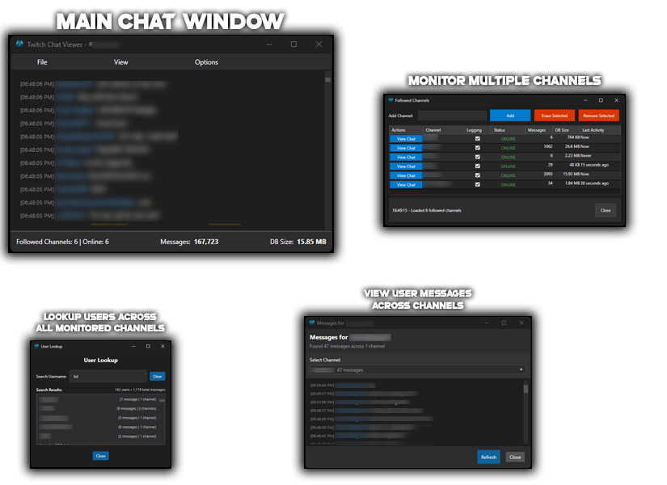

# Twitch Chat Viewer

A native Windows application built with C# and WPF that connects to Twitch IRC to display real-time chat messages.



## Features

### Core Chat Features
- **Real-time Chat Display**: Connect to any Twitch channel and view chat messages as they come in
- **Modern Dark UI**: Clean, modern interface with a dark theme optimized for viewing
- **Anonymous Connection**: No need for authentication - connects as an anonymous user
- **Auto-scrolling**: Chat automatically scrolls to show the latest messages with smart pause when scrolled away
- **Message Formatting**: Timestamps, usernames, and messages are clearly formatted with proper indentation

### Multi-Channel Management
- **Multiple Channel Monitoring**: Monitor and manage multiple Twitch channels simultaneously
- **Followed Channels Window**: Dedicated interface for managing your followed channels
- **Individual Channel Control**: Enable/disable logging per channel, view connection status and statistics
- **Channel Database Management**: Each channel maintains its own SQLite database for message history
- **Background Connection Management**: Channels can be monitored in the background with automatic reconnection

### User Interaction & Navigation
- **Username Click Navigation**: Click on any username to view that user's message history
- **@Mention Click Support**: Click on @mentions to quickly navigate to mentioned users
- **@Mention Highlighting**: Visual highlighting of @username mentions in orange with background color
- **User Lookup System**: Search for users across all channels with message counts and statistics
- **User Message History**: View complete message history for any user across all monitored channels

### User Management & Filtering
- **User Blacklist System**: Block specific users from appearing in chat and database logging
- **User Filters Window**: Easy-to-use interface for managing blacklisted users
- **Real-time Filter Application**: Blocked users are filtered from both display and database storage

### Font & Display Customization
- **Font Scaling Options**: Multiple preset font sizes (50%, 75%, 100%, 125%, 150%, 200%)
- **Ctrl+Scroll Zoom**: Use Ctrl+Mouse Wheel to dynamically adjust font size (6pt-36pt range)
- **Responsive Text Layout**: Proper text wrapping and hanging indentation for multi-line messages

### Data Persistence & Search
- **SQLite Database Storage**: All messages are stored locally in SQLite databases per channel
- **Message Search Capabilities**: Search through user message history with advanced filtering
- **Database Size Monitoring**: Track storage usage for each channel's message database
- **Message Statistics**: View message counts, last activity times, and user participation stats

### Advanced UI Features
- **Scroll-to-Top Button**: Appears when scrolled away from latest messages
- **Connection Status Indicators**: Real-time status updates for each channel (Online/Offline/Connecting)
- **Resize-Safe Message Handling**: Messages are queued during window resizing to prevent UI freezing
- **Error Handling & Diagnostics**: Comprehensive error reporting and diagnostic tools

## Installation

### Option 1: Download Release (Recommended)

**No .NET Framework Required!**

1. **Download the latest release** from the [Releases](../../releases) page
2. **Extract the executable** (TwitchChatViewer.exe) to any folder on your computer
3. **Double-click to run** - No installation or additional software needed!

The release executable is completely self-contained and includes all necessary dependencies. You don't need to install .NET Framework, .NET Runtime, or any other software.

**System Requirements for Release:**
- Windows 10/11 (64-bit)
- ~165 MB of disk space

### Option 2: Build from Source

If you want to build from source code or contribute to development:

**Prerequisites:**
- .NET 8.0 or later
- Windows 10/11
- Visual Studio 2022 or VS Code with C# extensions

## Getting Started

### Building from Source (For Developers)

1. Open a terminal in the project directory
2. Restore dependencies:
   ```powershell
   dotnet restore
   ```

3. Build the project:
   ```powershell
   dotnet build
   ```

4. Run the application:
   ```powershell
   dotnet run
   ```

### Creating an Executable

To create a standalone executable:

```powershell
dotnet publish -c Release -r win-x64 --self-contained
```

The executable will be created in `bin\Release\net8.0-windows\win-x64\publish\`

## How to Use

### Basic Chat Viewing
1. **Launch the Application**: 
   - **Release users**: Double-click `TwitchChatViewer.exe`
   - **Developers**: Use `dotnet run` or run from Visual Studio
2. **Click Options → Followed Channels**: Open the Followed Channels window
3. **Enter Channel Name**: Type the Twitch channel name (without the # symbol)
4. **Add Channel**: Click the "Add" button to start monitoring the channel
5. **View Chat**: Messages will appear in real-time in the chat area

### Multi-Channel Management
1. **Access Followed Channels**: Go to Options → Followed Channels
2. **Add Channels**: Enter channel names to monitor multiple channels simultaneously
3. **Toggle Logging**: Enable/disable message logging per channel using checkboxes
4. **Switch Channels**: Use "View in Main" to switch the main window to a specific channel
5. **Remove Channels**: Select channels and click "Erase Selected" to remove them

### User Interaction Features
- **Click Usernames**: Click any username in chat to view that user's complete message history
- **Click @Mentions**: Click on @mentions (highlighted in orange) to view mentioned user's messages
- **Search Users**: Use File → Lookup Users to search for users across all channels
- **Manage Filters**: Use File → User Filters to block unwanted users from chat and logging

### Font and Display Controls
- **Menu Font Scaling**: Use View → Font Scaling to choose preset sizes (50%-200%)
- **Ctrl+Scroll Zooming**: Hold Ctrl and scroll mouse wheel to dynamically adjust font size
- **Auto-Scroll Management**: Chat auto-scrolls to new messages; scroll up to pause, then use the "Scroll to Top" button to resume

### Database and Search Features
- **View User Statistics**: Double-click users in the User Lookup window to see detailed message history
- **Channel Statistics**: Monitor message counts, database sizes, and last activity times in the Followed Channels window
- **Message Persistence**: All messages are automatically saved to local SQLite databases (when logging is enabled)

## Technical Details

### Twitch IRC Connection

The application connects to Twitch's IRC servers using:
- **Server**: `irc.chat.twitch.tv`
- **Port**: `6667`
- **Authentication**: Anonymous (no OAuth required for reading chat)

## Troubleshooting

### Common Issues

1. **Connection Fails**: 
   - Check your internet connection
   - Ensure the channel name is correct (no # symbol needed)
   - Some channels may have restrictions or be offline

2. **No Messages Appearing**:
   - Verify the channel is active and has viewers chatting
   - Check that logging is enabled for the channel in Followed Channels
   - Check the application logs for any errors

3. **Performance Issues**:
   - The application automatically handles message cleanup (limited to 500 messages in main view)
   - Use "Clear Chat" button to reset if needed
   - Large databases may affect user lookup performance

4. **User Lookup Issues**:
   - Ensure channels have been monitored for some time to build message history
   - Database files are created in the `db/` folder relative to the executable
   - User searches require at least 2 characters

5. **Font/Display Issues**:
   - Use Ctrl+Mouse Wheel for quick font size adjustments
   - Font size is constrained between 6pt and 36pt for readability
   - Window resizing temporarily pauses message processing to prevent UI freezing

## Development

### Dependencies

- Microsoft.Extensions.DependencyInjection (8.0.0)
- Microsoft.Extensions.Logging (8.0.0)
- Microsoft.Extensions.Logging.Console (8.0.0)
- Microsoft.Data.Sqlite (8.0.0) - For local message storage
- System.Text.Json - For configuration and settings management

### Project Architecture

The application follows a modular architecture with dependency injection:

- **MainWindow**: Primary UI for chat display and user interaction
- **MultiChannelManager**: Handles multiple IRC connections and channel management
- **TwitchIrcClient**: Manages individual Twitch IRC connections
- **ChatDatabaseService**: Handles SQLite database operations for message persistence
- **UserFilterService**: Manages user blacklist functionality
- **UserMessageLookupService**: Provides user search and message history features
- **ChannelSettingsManager**: Persists per-channel settings (logging preferences, etc.)
- **FollowedChannelsStorage**: Manages the list of followed channels

## License

This project is open source and available under the MIT License.

```
MIT License

Permission is hereby granted, free of charge, to any person obtaining a copy
of this software and associated documentation files (the "Software"), to deal
in the Software without restriction, including without limitation the rights
to use, copy, modify, merge, publish, distribute, sublicense, and/or sell
copies of the Software, and to permit persons to whom the Software is
furnished to do so, subject to the following conditions:

The above copyright notice and this permission notice shall be included in all
copies or substantial portions of the Software.

THE SOFTWARE IS PROVIDED "AS IS", WITHOUT WARRANTY OF ANY KIND, EXPRESS OR
IMPLIED, INCLUDING BUT NOT LIMITED TO THE WARRANTIES OF MERCHANTABILITY,
FITNESS FOR A PARTICULAR PURPOSE AND NONINFRINGEMENT. IN NO EVENT SHALL THE
AUTHORS OR COPYRIGHT HOLDERS BE LIABLE FOR ANY CLAIM, DAMAGES OR OTHER
LIABILITY, WHETHER IN AN ACTION OF CONTRACT, TORT OR OTHERWISE, ARISING FROM,
OUT OF OR IN CONNECTION WITH THE SOFTWARE OR THE USE OR OTHER DEALINGS IN THE
SOFTWARE.
```
