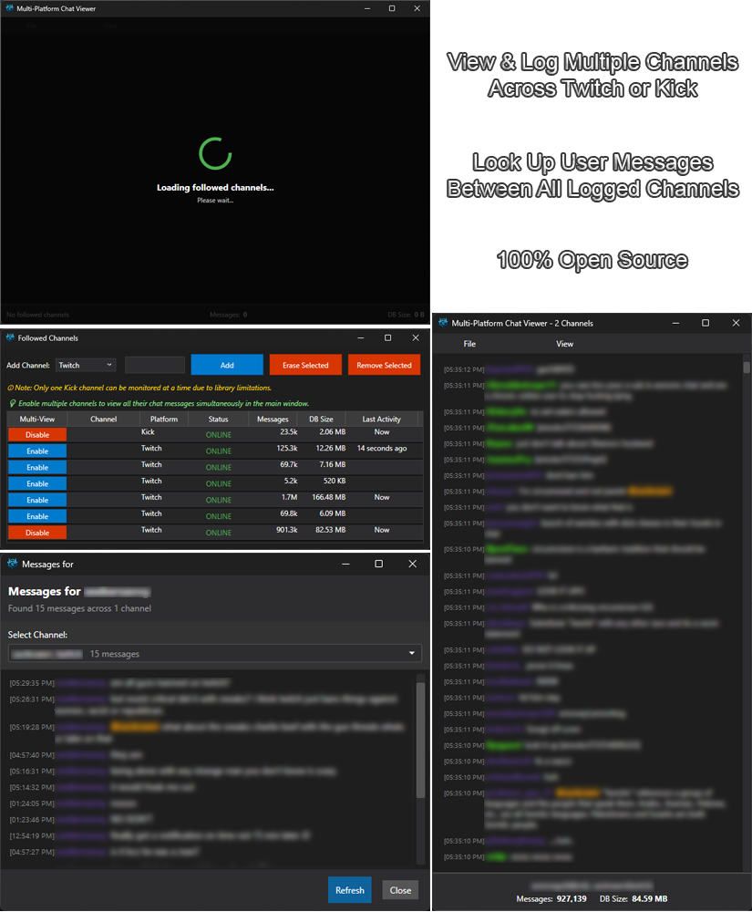

# Multi Chat Viewer

A native Windows application built with C# and WPF that connects to Twitch IRC and Kick.com chat to display real-time chat messages from both platforms with advanced multi-platform support.



## Features

### Core Chat Features
- **Real-time Chat Display**: Connect to any Twitch or Kick.com channel and view chat messages as they come in
- **Multi-Platform Support**: Support for both Twitch and Kick.com chat platforms with unified interface
- **Modern Dark UI**: Clean, modern interface with a dark theme optimized for viewing
- **Anonymous Connection**: No need for authentication - connects as an anonymous user (Twitch) or guest (Kick)
- **Auto-scrolling**: Chat automatically scrolls to show the latest messages with smart pause when scrolled away
- **Message Formatting**: Timestamps, usernames, and messages are clearly formatted with proper indentation

### Multi-Channel Management & Viewing
- **Multiple Channel Monitoring**: Monitor and manage multiple channels from both Twitch and Kick.com simultaneously
- **Multi-Channel Viewing**: Switch between different channels in the main chat window with "Enable" button in the Multi-View column
- **Background Channel Monitoring**: Channels continue logging messages in the background while viewing other channels
- **Platform Selection**: Choose between Twitch and Kick.com when adding new channels
- **Channel Database Management**: Each channel maintains its own SQLite database for message history with platform metadata
- **Real-time Channel Statistics**: View live message counts, last activity times, and database sizes for each channel
- **Connection Status Monitoring**: Real-time status indicators (ONLINE/OFFLINE) with color-coded display

### User Interaction & Navigation
- **Username Click Navigation**: Click on any username to view that user's message history
- **@Mention Click Support**: Click on @mentions to quickly navigate to mentioned users
- **@Mention Highlighting**: Visual highlighting of @username mentions in orange with background color
- **Streamer Mentions Window**: Dedicated window to track mentions of the streamer's name across all active channels
- **User Lookup System**: Search for users across all channels with message counts and statistics
- **User Message History**: View complete message history for any user across all monitored channels

### User Management & Filtering
- **User Blacklist System**: Block specific users from appearing in chat and database logging
- **User Filters Window**: Easy-to-use interface for managing blacklisted users
- **Real-time Filter Application**: Blocked users are filtered from both display and database storage

### Font & Display Customization
- **Font Scaling Options**: Multiple preset font sizes (50%, 75%, 100%, 125%, 150%, 200%)
- **Ctrl+Scroll Zoom**: Use Ctrl+Mouse Wheel to dynamically adjust font size (6pt-36pt range)
- **Responsive Text Layout**: Proper text wrapping and hanging indentation for multi-line messages

### Data Persistence & Search
- **SQLite Database Storage**: All messages are stored locally in SQLite databases per channel with platform metadata
- **Platform-Aware Database Management**: Each database stores platform information for proper channel identification
- **Message Search Capabilities**: Search through user message history with advanced filtering
- **Database Size Monitoring**: Track storage usage for each channel's message database
- **Message Statistics**: View message counts, last activity times, and user participation stats

### Advanced UI Features
- **Scroll-to-Top Button**: Appears when scrolled away from latest messages
- **Connection Status Indicators**: Real-time status updates for each channel (Online/Offline/Connecting)
- **Resize-Safe Message Handling**: Messages are queued during window resizing to prevent UI freezing
- **Error Handling & Diagnostics**: Comprehensive error reporting and diagnostic tools

## Platform Support

### Twitch
- **Anonymous Connection**: Connect to any Twitch channel without authentication
- **Full IRC Support**: Uses standard Twitch IRC protocol for reliable message delivery
- **Real-time Updates**: Instant message display with proper formatting

### Kick.com
- **Guest Connection**: Connect to any Kick.com channel as a guest user
- **WebSocket Integration**: Uses Kick's unofficial API for real-time chat access
- **Automatic Chatroom Discovery**: Automatically resolves channel names to chatroom IDs
- **Full Feature Parity**: All chat viewing, logging, and user management features work identically

### Platform Management
- **Unified Interface**: Single application manages both Twitch and Kick channels
- **Platform Indicators**: Clear visual indicators show which platform each channel uses
- **Database Isolation**: Each platform's channels are stored in separate databases with platform metadata
- **Legacy Support**: Existing Twitch-only databases are automatically detected and migrated

## Installation

### Option 1: Download Release (Recommended)

**No .NET Framework Required!**

1. **Download the latest release** of 'MultiChatViewer.exe' from the [Releases](../../releases) page
2. **Double-click to run** - No installation or additional software needed!

The release executable is completely self-contained and includes all necessary dependencies. You don't need to install .NET Framework, .NET Runtime, or any other software.

**System Requirements for Release:**
- Windows 10/11 (64-bit)
- ~165 MB of disk space for the executable
- ~90-100 MB of disk space per 1 million messages saved in databases

### Windows Security Warning

When you first run the downloaded executable, Windows may display a warning message saying the file is from an "unknown publisher" or showing "Windows protected your PC". This is completely normal and expected behavior for executables that haven't been digitally signed with an expensive code signing certificate.

**Why does this happen?**
- Code signing certificates cost hundreds of dollars annually
- As an open-source project, we distribute unsigned executables to keep the software free
- Windows shows this warning for any executable without a valid digital signature
- This doesn't mean the software is unsafe - it just means Microsoft doesn't recognize the publisher

**How to run the program safely:**

1. **When you see "Windows protected your PC" dialog:**
   - Click **"More info"** link at the bottom left
   - Click **"Run anyway"** button that appears
   - The program will start normally

2. **Alternative method - Right-click approach:**
   - Right-click on `MultiChatViewer.exe`
   - Select **"Properties"**
   - Check the **"Unblock"** checkbox at the bottom (if present)
   - Click **"OK"**
   - Double-click the executable to run

3. **Adding to Windows Defender exceptions (optional):**
   - Open Windows Security → Virus & threat protection
   - Add the executable folder to your exclusions list
   - This prevents future scanning delays but isn't required

**Is this safe?**
- The source code is completely open and available for inspection on GitHub
- You can build the executable yourself from source if you prefer
- The warning is purely about the lack of a digital signature, not about malicious content
- Many legitimate open-source applications show this same warning

If you're still concerned, you can always build the application from source code using the instructions below.

### Option 2: Build from Source

If you want to build from source code or contribute to development:

**Prerequisites:**
- .NET 8.0 or later
- Windows 10/11
- Visual Studio 2022 or VS Code with C# extensions

## Getting Started

### Building from Source (For Developers)

1. Open a terminal in the project directory
2. Restore dependencies:
   ```powershell
   dotnet restore
   ```

3. Build the project:
   ```powershell
   dotnet build
   ```

4. Run the application:
   ```powershell
   dotnet run
   ```

### Creating an Executable

To create a standalone executable:

```powershell
dotnet publish -c Release -r win-x64 --self-contained
```

The executable will be created in `bin\Release\net8.0-windows\win-x64\publish\`

## How to Use

### Basic Chat Viewing
1. **Launch the Application**: 
   - **Release users**: Double-click `MultiChatViewer.exe`
   - **Developers**: Use `dotnet run` or run from Visual Studio
2. **Click Options → Followed Channels**: Open the Followed Channels window
3. **Enter Channel Name**: Type the Twitch or Kick channel name (without the # symbol for Twitch)
4. **Select Platform**: Choose Twitch or Kick from the platform dropdown
5. **Add Channel**: Click the "Add" button to start monitoring the channel
6. **Enable Viewing**: Click the "Enable" button in the **Multi-View column** to start viewing that channel's chat in the main window
7. **View Chat**: Messages will appear in real-time in the chat area for the currently viewed channel

### Multi-Channel Workflow
1. **Add Multiple Channels**: Add several channels from different platforms to monitor simultaneously
2. **Background Monitoring**: All added channels collect messages in the background, even when not actively viewed
3. **Switch Between Channels**: Use "Enable" or "Disable" button in the **Multi-View column** to control which channel's chat is displayed in the main window
4. **Monitor Statistics**: View real-time message counts, connection status, and last activity for all channels
5. **Manage Logging**: Control which channels save messages to database independently of viewing

### Multi-Channel Management & Viewing
1. **Access Followed Channels**: Go to Options → Followed Channels
2. **Select Platform**: Choose between Twitch and Kick.com from the platform dropdown
3. **Add Channels**: Enter channel names to monitor multiple channels simultaneously
4. **Platform Indicators**: The platform column shows which service each channel uses with color-coded badges
5. **Toggle Viewing**: Use "Enable" or "Disable" button in the **Multi-View column** to control which channel is displayed in the main window
6. **Toggle Logging**: Enable/disable message logging per channel using separate logging controls
7. **Switch Channels**: Click "Enable" button in the **Multi-View column** to switch viewing to a different channel
8. **Background Monitoring**: Channels continue collecting messages in the background even when not actively viewed
9. **Channel Statistics**: Monitor real-time message counts, connection status, and database sizes
10. **Remove Channels**: Select channels and click "Erase Selected" to remove them and their databases

## Configuration

The application uses a single unified configuration file called `appsettings.json` that stores all settings in one convenient location:

- **Followed Channels**: List of channels you're monitoring, including their logging preferences
- **User Filters**: Blacklisted users that are filtered from chat and database logging  
- **Channel Settings**: Per-channel preferences like logging enabled/disabled status

The configuration file is automatically created and managed by the application. You don't need to manually edit it, but it's stored in JSON format for easy backup or transfer between systems.

**Configuration File Location:**
- The `appsettings.json` file is created in the same directory as the application executable
- All settings are automatically saved when you make changes through the UI
- The file is human-readable JSON format for easy inspection or backup

## Development

### Dependencies

- **KickLib** (1.4.3) - Unofficial Kick.com API and WebSocket chat client library
- **Microsoft.Extensions.DependencyInjection** (9.0.5)
- **Microsoft.Extensions.Logging** (9.0.5)
- **Microsoft.Extensions.Logging.Console** (9.0.5)
- **Microsoft.Data.Sqlite** (9.0.6) - For local message storage
- **System.Security.Cryptography.ProtectedData** (9.0.0) - For secure credential storage

## Acknowledgments

This project uses several open-source libraries that make it possible:

### KICKLib
- **Library**: [KICKLib](https://github.com/Bukk94/KickLib) by the KickLib team
- **Version**: 1.4.3
- **Purpose**: Provides unofficial API access and WebSocket chat functionality for Kick.com
- **License**: MIT License
- **Special Thanks**: To the KickLib developers for creating and maintaining this excellent library that enables Kick.com chat integration

The Kick.com chat functionality in this application is entirely powered by KICKLib. Without their work, multi-platform chat viewing would not be possible.

## License

This project is open source and available under the MIT License.

```
MIT License

Permission is hereby granted, free of charge, to any person obtaining a copy
of this software and associated documentation files (the "Software"), to deal
in the Software without restriction, including without limitation the rights
to use, copy, modify, merge, publish, distribute, sublicense, and/or sell
copies of the Software, and to permit persons to whom the Software is
furnished to do so, subject to the following conditions:

The above copyright notice and this permission notice shall be included in all
copies or substantial portions of the Software.

THE SOFTWARE IS PROVIDED "AS IS", WITHOUT WARRANTY OF ANY KIND, EXPRESS OR
IMPLIED, INCLUDING BUT NOT LIMITED TO THE WARRANTIES OF MERCHANTABILITY,
FITNESS FOR A PARTICULAR PURPOSE AND NONINFRINGEMENT. IN NO EVENT SHALL THE
AUTHORS OR COPYRIGHT HOLDERS BE LIABLE FOR ANY CLAIM, DAMAGES OR OTHER
LIABILITY, WHETHER IN AN ACTION OF CONTRACT, TORT OR OTHERWISE, ARISING FROM,
OUT OF OR IN CONNECTION WITH THE SOFTWARE OR THE USE OR OTHER DEALINGS IN THE
SOFTWARE.
```
